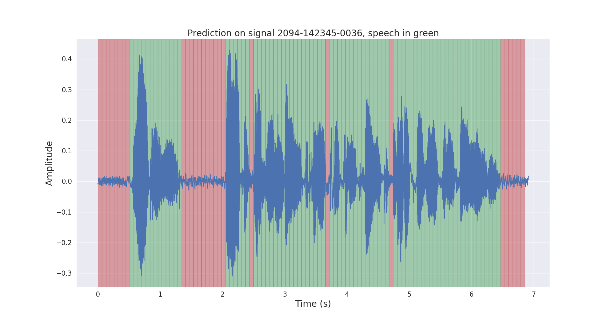
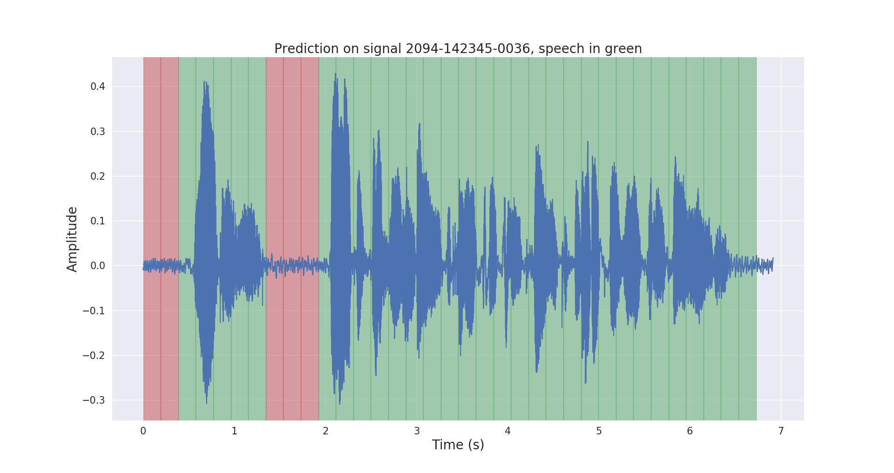

# Voice Activity Detection to detect voice or not voice(noise)

## Design and Execution of VAD

- Please select one of the AI architectures available for VAD.
- Please provide a benchmarking script to evaluate the VAD input is audio files and output is if VAD is categorizing voice and not voice at specified timestamp properly
- Perform pre-training based on an additional VAD dataset
- Please run benchmarking script to evaluate the VAD after pre-training and demonstrate improvement in accuracy 
- Please run benchmarking script to evaluate the new VAD module against VAD provided by webrtc

[Benchmark script of pretrained model and evaluation curves and matrix implemented in Tensorflow](https://github.com/filippogiruzzi/voice_activity_detection)
 
[Benchmark script of pretrained model and evaluation curves and matrix implemented in Pytorch](https://github.com/nicklashansen/voice-activity-detection)

# 1. Tensorflow pretrained models
The purpose of this project is to design and implement a real-time Voice Activity Detection here i used already labelled data which is in json format or download the original dataset from here https://openslr.org/12/.

The designed solution is based on MFCC feature extraction and a 1D-Resnet model that classifies whether a audio signal is speech or noise.
i trined it or google golab the original notebook used 2619 itmes but for less time i used 1000 items

### 1.1 Result (my google colab notebook)
| Model | Train acc. | Val acc. | Test acc. |
| :---: |:---:| :---:| :---: |
| 1D-Resnet | 94 % | 92 % | 91 % |

### 1.2 Results (reference github repo)

| Model | Train acc. | Val acc. | Test acc. |
| :---: |:---:| :---:| :---: |
| 1D-Resnet | 99 % | 98 % | 97 % |

Raw and post-processed inference results on a test audio signal are shown below.

You can prefer the https://github.com/filippogiruzzi/voice_activity_detection github repositoty to see the benchmark script for pretrained model and full guidenace how to install this project and use.

# 2. Pytorch pretrained models
The purpose of this project is to design and implement a real-time Voice Activity Detectio with the help of Pytorch but here dataset used in FLAC audio format the dataset is very huge and take 16 hours to train the model so here i only referring the github repo which include benchmark scripting , evoluition matrix and also comparison with webrtc.
The webrtc comparion given in [pytorch_vad.ipnyb](https://github.com/nicklashansen/voice-activity-detection/blob/master/vad.ipynb) Notebook

### 1.2 Results

All results shown here are for samples generated with a SNR (signal-to-noise ratio) of -3 dB, which -- for the unfamiliar reader -- is a substantial amount of noise.

ROC Curve

Example of a label

Associated NN prediction

